<p align="center">
  
</p>

<div align="center">
  
</div>

<p align="center">
  
  
</p>


##  &nbsp;About Me


```java
@Component
public class INFO333 implements Developer {

    @Value("Java Full-Stack Developer")
    private String role;
    
    private final List<String> languages = List.of(
        "Java", "TypeScript", "JavaScript", "SQL"
    );
    
    private final List<String> backend = List.of(
        "Spring Boot", "Spring Security", 
        "Hibernate", "Microservices"
    );
    
    private final List<String> frontend = List.of(
        "React", "Angular", "Redux"
    );
    
    private final List<String> databases = List.of(
        "PostgreSQL", "MongoDB", "Redis"
    );
    
    @Override
    public String getMotto() {
        return "Code with purpose, build with passion ☕";
    }
}
```

<br clear="right"/>


##  &nbsp;Tech Stack

<div align="center">
  
  
  
  
  
  
  
  
  
  
</div>

<br/>

<div align="center">

| 💻 **Backend** | 🎨 **Frontend** | ☁️ **Cloud & DevOps** |
|:---:|:---:|:---:|
|  |  |  |

| 🗄️ **Databases** | 🔧 **Tools** |
|:---:|:---:|
|  |  |

</div>


##  &nbsp;Featured Projects

<div align="center">
  
</div>

<br/>

| Project | Tech Stack | Description |
|:---|:---|:---|
| 🏦 **Enterprise Banking** | `Java` `Spring Boot` `Angular` `AWS` `Kafka` | Scalable microservices handling 1M+ transactions |
| 🛒 **E-Commerce Platform** | `Java` `React` `Redux` `Redis` `Docker` | High-performance checkout system |
| 🏥 **Healthcare System** | `Spring Cloud` `PostgreSQL` `Kubernetes` | HIPAA-compliant patient management |
| 📊 **Analytics Dashboard** | `Java` `Angular` `MongoDB` `Elasticsearch` | Real-time BI with sub-second queries |
| 🔐 **Auth Gateway** | `Spring Security` `OAuth2` `JWT` `Redis` | Centralized auth for 50K+ sessions |
| 📱 **Mobile Banking API** | `Java` `Spring Boot` `React Native` | RESTful APIs with 99.9% uptime |


##  &nbsp;Architecture

<div align="center">
  
</div>

<br/>



<br/>

<div align="center">

```mermaid
%%{init: {'theme': 'dark', 'themeVariables': { 'primaryColor': '#6C63FF', 'primaryTextColor': '#fff', 'lineColor': '#00d4ff'}}}%%
flowchart TB
    subgraph CLIENT["🖥️ Client Layer"]
        A[🌐 React App]
        B[📱 Angular Dashboard]
    end
    
    subgraph GATEWAY["🚪 Gateway"]
        C[⚖️ Load Balancer]
        D[🔐 API Gateway]
    end
    
    subgraph SERVICES["⚙️ Microservices"]
        E[👤 User Service]
        F[📦 Order Service]
        G[💳 Payment Service]
    end
    
    subgraph DATA["💾 Data Layer"]
        H[(PostgreSQL)]
        I[(Redis)]
        J[Kafka]
    end
    
    CLIENT --> GATEWAY --> SERVICES --> DATA
```

| Principle | Description |
|:---:|:---|
| 🔗 **Loose Coupling** | Services communicate via APIs |
| 🛡️ **Service Isolation** | Each service owns its data |
| 📈 **Scalability** | Horizontal scaling on demand |
| 🔄 **Fault Tolerance** | Circuit breakers & graceful degradation |

</div>


##  &nbsp;GitHub Stats

<div align="center">
  
</div>

<br/>

<p align="center">
  
  
</p>

<p align="center">
  
</p>

<p align="center">
  
</p>

<p align="center">
  
</p>


##  &nbsp;Connect

<div align="center">
  <a href="mailto:infotube45@gmail.com">
    
  </a>
  &nbsp;
  <a href="https://www.linkedin.com/in/info333/">
    
  </a>
  &nbsp;
  <a href="https://github.com/INFO333">
    
  </a>
</div>

<br/>

<div align="center">
  
</div>

<br/>

<div align="center">
  
</div>

<div align="center">
  
**💬 *"First, solve the problem. Then, write the code."***

**🚀 Open for collaboration &nbsp;|&nbsp; ☕ Let's build something amazing!**

</div>

<br/>


