<h1 align="center">
  
  Hey there, I'm INFO333!
  
</h1>

<div align="center">
  
</div>

<br/>

<p align="center">
  <a href="https://git.io/typing-svg">
    
  </a>
</p>

<p align="center">
  
</p>

<p align="center">
  <em>✨ Passionate about creating elegant, scalable, and production-ready systems ✨</em>
</p>

<br/>

<p align="center">
  
  &nbsp;
  <a href="https://github.com/INFO333">
    
  </a>
  &nbsp;
  <a href="https://www.linkedin.com/in/info333/">
    
  </a>
  &nbsp;
  <a href="mailto:infotube45@gmail.com">
    
  </a>
</p>

<br/>


<br/>

##  About Me


```yaml
name: INFO333
location: 🌍 Earth
current_focus: Enterprise Java Solutions

passion:
  - Clean Architecture
  - Scalable Systems  
  - Problem Solving

motto: "Code with purpose, build with passion"
```

<br/>

- 🔭 **Currently crafting:** Production-grade systems with **Java & Spring Boot**
- 🌱 **Learning:** **Kubernetes**, **AWS**, & **Advanced System Design**  
- 💬 **Let's talk about:** Java, Microservices, System Design
- 🎯 **Goal:** Building software that makes a difference
- ⚡ **Fun fact:** I debug with coffee ☕

<br clear="right"/>

<br/>


<br/>

##  Tech Arsenal

<br/>

<div align="center">

| 💻 **Backend** | 🎨 **Frontend** | ☁️ **Cloud & DevOps** |
|:---:|:---:|:---:|
|  |  |  |

<br/>

| 🗄️ **Databases** | 🔧 **Tools** |
|:---:|:---:|
|  |  |

</div>

<br/>


<br/>

##  Featured Projects

<br/>

<div align="center">

<a href="#">
  
</a>
<a href="#">
  
</a>

</div>

<br/>

| 🚀 Project | 🛠️ Stack | 📝 Description |
|:---|:---|:---|
| **🏦 Enterprise Finance** | `Java` `Spring Boot` `AWS` `Kafka` | High-volume financial microservices with secure APIs |
| **🛒 E-Commerce Platform** | `Java` `React` `Redis` `Docker` | Scalable checkout system for high-traffic users |
| **🏥 MedSystem Pro** | `Spring` `PostgreSQL` `Docker` | Healthcare appointment management system |

<br/>


<br/>

##  Architecture Philosophy

<br/>

<div align="center">



</div>

<br/>

<div align="center">
  
```mermaid
%%{init: {'theme': 'dark', 'themeVariables': { 'primaryColor': '#6C63FF', 'primaryTextColor': '#fff', 'primaryBorderColor': '#6C63FF', 'lineColor': '#6C63FF', 'secondaryColor': '#1a1a2e', 'tertiaryColor': '#16213e'}}}%%
flowchart LR
    A[🌐 Client] --> B[🚪 API Gateway]
    B --> C[🔐 Auth Service]
    B --> D[👤 User Service]
    B --> E[📦 Order Service]
    E --> F[(🗄️ Database)]
    E --> G[(⚡ Redis Cache)]
    E -.->|📨 Events| H[🔔 Notifications]
    
    style A fill:#6C63FF,stroke:#6C63FF
    style B fill:#1a1a2e,stroke:#6C63FF
    style C fill:#1a1a2e,stroke:#6C63FF
    style D fill:#1a1a2e,stroke:#6C63FF
    style E fill:#1a1a2e,stroke:#6C63FF
```

| 🎯 Principle | 📖 Description |
|:---:|:---|
| **🔗 Loose Coupling** | Services communicate through well-defined APIs |
| **🛡️ Service Isolation** | Each service owns its data and logic |
| **📈 Scalability** | Horizontal scaling based on demand |
| **🔄 Fault Tolerance** | Graceful degradation & circuit breakers |

</div>

<br/>


<br/>

##  GitHub Stats

<br/>

<div align="center">
  
  &nbsp;&nbsp;
  
</div>

<br/>

<div align="center">
  
</div>

<br/>

<div align="center">
  
</div>

<br/>


<br/>

##  Let's Connect!

<br/>

<div align="center">
  
  <a href="mailto:infotube45@gmail.com">
    
  </a>
  &nbsp;
  <a href="https://www.linkedin.com/in/info333/">
    
  </a>
  &nbsp;
  <a href="https://github.com/INFO333">
    
  </a>

</div>

<br/>

<div align="center">
  
</div>

<br/>

<div align="center">
  
</div>

<div align="center">
  <b>⭐ If you like my work, consider giving a star! ⭐</b>
  <br/><br/>
  
</div>
